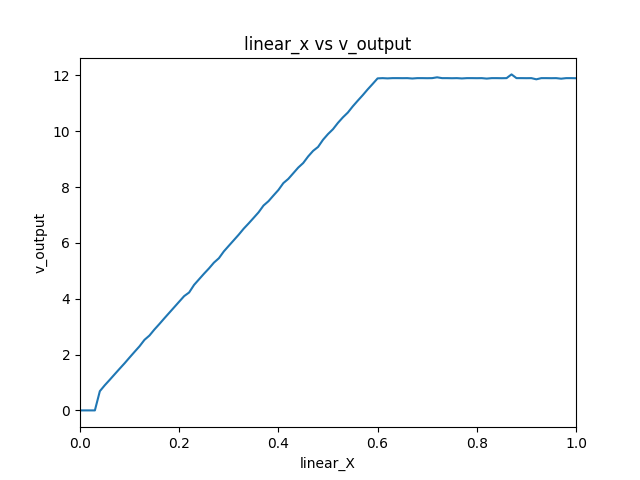
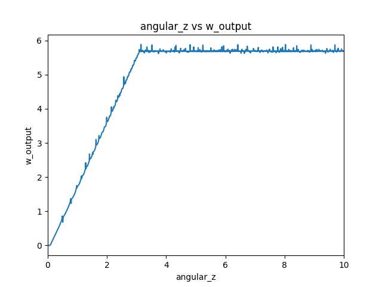

# Robot Control and Characterization

This repository contains ROS (Robot Operating System) nodes and launch files for controlling the Puzzlebot robot and performing speed characterization and testing.

## 1. Speed Characterization for Puzzlebot

To perform speed characterization for the Puzzlebot and obtain its nominal linear and angular velocities, follow these steps:

a. Launch the required nodes by running the provided launch file:
   ```
   $ roslaunch minc4 routine.launch
   ```

b. Uncomment the line in the launch file that starts the `speed_characterization` node:
   ```xml
   <!-- <node name="speed_characterization" pkg="minc4" type="speed_characterization.py" output="screen"/> -->
   ```

c. After running the launch file, the `speed_characterization` node will be executed. This node will send various linear and angular velocity commands to the Puzzlebot and record the actual linear and angular velocities in `output.txt` and `output2.txt` files, respectively.

d. Analyze the recorded data in `output.txt` and `output2.txt` to determine the nominal linear and angular velocities for the Puzzlebot. You can use python or Excel to analize the dead, linear and saturation zones to obtain the nominal velues.
<p float="left">
  
  
</p>

## 2. Testing Connection with the Robot

To test the connection with the Puzzlebot and ensure proper communication, follow these steps:

a. Launch the required nodes by running the provided launch file:
   ```
   $ roslaunch minc4 routine.launch
   ```

b. Uncomment the line in the launch file that starts the `line_routine` node:
   ```xml
   <!-- <node name="line_routine" pkg="minc4" type="line_routine.py" output="screen"/> -->
   ```

c. After running the launch file, the `line_routine` node will be executed. This node will send velocity commands to the Puzzlebot to make it move in a straight line.

d. Observe the Puzzlebot's movement to confirm successful communication and control.

## 3. Open-Loop Control Routine

The `puzzlebot_routine` node implements an open-loop control routine for the Puzzlebot using a state machine programming approach. This node sends velocity commands to the Puzzlebot to make it move in a square pattern.
Demo video

%20[Running]%20-%20Oracle%20VM%20VirtualBox%202024-03-12%2010-24-46.mp4)

The `smoother_routine` node is also included in the launch file, although its purpose is to move the smoother instead of the puzzlebot.


To run the open-loop control routine, launch the required nodes by running the provided launch file:
```
$ roslaunch minc4 routine.launch
```

The `puzzlebot_routine` and/or `smoother_routine` nodes will be executed, and the Puzzlebot will move in a parallelogram pattern based on the open-loop control commands.

## Robustness and Speed Characterization

To ensure robustness in the open-loop control routine, the speed characterization process was performed for the Puzzlebot. By obtaining the nominal linear and angular velocities, the velocity commands sent to the robot can be adjusted to achieve the desired movement accurately.

Additionally, the state machine programming approach used in the `puzzlebot_routine` node provides a structured way to control the robot's behavior, making it easier to manage and modify the control logic as needed.

